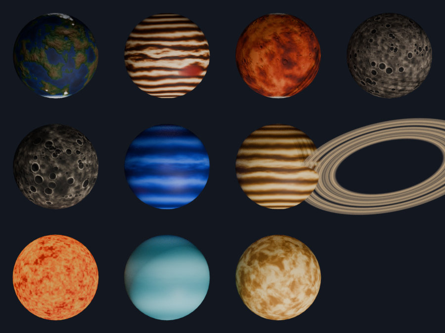

# Solar System

Interactive 3D Solar System for mobile exploration — the Sun, the eight planets
and their major moons, orbiting in real time with accurate orbital mechanics.

Built with Flutter.

---

## Status

The physics engine, 3D scene and interface are in place. Next up: NASA data
integration, more moons, and atmospheric effects.



## Features

- Real-time 3D rendering of the Sun, the eight planets and the Moon
- Orbits computed from published Keplerian elements, not animation loops
- Free movement through the system: one finger orbits the view, two fingers
  pan across it, pinch zooms, and a control returns to the overview
- Time holds still while you move the view, so a planet stays put long enough
  to look at its far side
- Tap a body for its details, or jump straight to one
- Time control from real time to a year per second, pause, and back to now
- Toggle orbit paths and moons, or switch to true scale to see how empty the
  solar system really is

### Planned

- Live data from NASA / JPL Horizons
- The major moons of Jupiter, Saturn, Uranus and Neptune
- Atmospheric shaders and a solar corona

## How it works

**The bodies are the real ones.** Earth is NASA surface imagery, so the
continents are the actual continents, with its cloud deck composited over the
top and national borders traced from Natural Earth's polygons. The Moon is the
NASA lunar albedo, and its relief is stamped from 24,520 catalogued craters —
every one of 4 km and larger from the published Head and Povilaitis surveys —
each at its real longitude and latitude and sized from its real diameter.
Mercury and Mars carry their real topography as relief, Saturn's rings are a
slice of the real ring system, and the rest use surface maps. Venus is the
exception: its surface is only mapped by radar and is never visible from space,
so it is drawn as the cloud deck you would actually see.

Where a map is more colourful than the body really is, the chroma is pulled
back toward a measured tint rather than discarded, keeping the real structure.
Provenance and terms for every dataset are in
[tools/blender/data/SOURCES.md](tools/blender/data/SOURCES.md) — some need
checking before a commercial release.

**The asteroid belt** is 6,000 bodies on their own Keplerian orbits, not a
texture or a spinning ring. Each has its own semi-major axis, eccentricity and
inclination, so the belt is a torus with real thickness — asteroids stand up to
an AU out of the ecliptic — and the inner ones lap the outer ones as time runs.

Its gaps are not decoration. Each Kirkwood gap sits where an asteroid's orbital
period would fall into a whole-number ratio with Jupiter's, so Jupiter tugs it
at the same point in every orbit until the region empties. The app derives
those positions from the resonance arithmetic rather than hard-coding them, and
they land on the observed gaps at 2.06, 2.50, 2.82, 2.96 and 3.28 AU.
`test/asteroid_belt_test.dart` checks each gap against the belt either side of
it.

Individual asteroids are drawn from the belt's measured distributions rather
than a survey catalogue, because the archives are not reachable from the build
environment. `tools/fetch_asteroids.py` swaps in the real catalogue wherever
the network allows, writing the same columns with no code change.

**Positions.** Each planet carries the Jet Propulsion Laboratory's approximate
Keplerian elements for J2000 with their per-century rates. Every frame the
elements are advanced to the simulated instant, Kepler's equation `M = E - e
sin E` is solved by Newton-Raphson for the eccentric anomaly, and the result is
rotated from the orbital plane into ecliptic coordinates by the argument of
perihelion, inclination and longitude of the ascending node. Orbits are
genuinely elliptical and correctly inclined; the planets are where they
actually are on the date shown.

`test/physics_test.dart` checks this against known astronomy: every orbital
period closes to under a degree of drift, Earth reaches perihelion in early
January at 0.983 AU, Kepler's third law holds across all eight planets, and the
Moon stays between its real perigee and apogee.

**Scale.** Distances and radii are compressed by fractional powers, which keeps
the ordering and the sense of proportion while fitting on a screen. True scale
is one toggle away, and shows why nobody draws it that way.

**Rendering.** `three_js` on an ANGLE/OpenGL surface. Each body is three nested
nodes — position, axial tilt, spin — so a planet can orbit, lean and rotate
independently. Tap selection is a raycast against the scene.

**Rendering.** There is no 3D engine and no OpenGL plugin. The models are read
straight out of their glTF binaries, and the app transforms and projects the
vertices itself, then hands the triangles to `Canvas.drawVertices` with the
texture as a shader. Flutter rasterises them on the GPU like anything else it
draws.

That decision came from a device where the OpenGL plugin's native surface never
initialised: the app sat on a loading screen with nothing to report, because
the renderer starts below any code the app controls. Drawing through the canvas
removes the native handshake, the platform-specific renderer settings and the
plugin's pure-Dart image decoding all at once — textures are now decoded by the
engine, so loading takes well under a second instead of minutes.

Lighting is per-vertex: a lambert term from the direction of the Sun, plus a
weak fill from the camera so the body you are looking at stays readable. Only
front-facing triangles in front of the eye are drawn, which is enough to sort a
closed shell without a depth buffer, and bodies are painted furthest first.

Because it is all ordinary Dart and canvas work, the scene can be rendered in a
test: `test/scene_probe_test.dart` writes real frames to
`build/render_probe/`.

## Requirements

- Flutter SDK (stable channel), Dart 3.8 or newer
- JDK 17 for Android builds
- Android SDK (installed with Android Studio or the command line tools)

Check your setup with:

```bash
flutter doctor
```

## Getting started

```bash
git clone https://github.com/DEVENDRAP7/Solar-System.git
cd Solar-System

# Generate the platform folders once (they are not committed by default)
flutter create --platforms=android --project-name solar_system_app --org com.devendra .

flutter pub get
flutter run
```

Commit the generated `android/` folder when you want to customise the
application id, app icon, permissions or signing configuration — the CI
workflow uses the committed folder whenever one is present.

## Project structure

```
.
├── .github/workflows/build_apk.yml   CI: analyze, test, build and publish the APK
├── assets/
│   ├── data/                         bodies.json — radii, rotation periods, tilts
│   ├── images/                       Icons and image assets
│   └── models/                       3D models (.glb), generated
├── tools/blender/                    Model generation pipeline
├── lib/
│   ├── config/                       Theme and the scene's scale mapping
│   ├── models/                       Bodies, orbital elements, the catalog
│   ├── providers/                    State management
│   ├── screens/                      Full-page screens
│   ├── services/
│   │   ├── physics/                  Kepler solver and the simulation clock
│   │   └── render/                   glTF reader, camera, painter
│   ├── widgets/                      Reusable widgets
│   └── main.dart                     Entry point
├── test/                             Unit and widget tests
├── analysis_options.yaml             Lint and analyzer configuration
└── pubspec.yaml                      Dependencies and asset declarations
```

## 3D models

The Sun, eight planets, the Moon and Saturn's rings live in `assets/models/`
as glTF binaries, generated by the scripts in `tools/blender/`:

```bash
blender -b -P tools/blender/build_models.py -- --out assets/models --res 1024
```

Every body carries a procedurally generated colour map, and those with relief
carry a normal map as well — craters on the Moon and Mercury, continents and
snow lines on Earth, wind bands on the gas giants. A full rebuild takes about
20 seconds on any machine, with no GPU required, and is deterministic: the same
seed always produces the same planets.

Meshes are unit spheres (2,208 triangles each, 8 MB for the whole set, most of
it the Moon's crater relief). True
sizes, rotation periods and axial tilts are in `assets/data/bodies.json` so the
app picks its own scale — a solar system at literal scale is mostly empty space.
See [tools/blender/README.md](tools/blender/README.md) for the details.

## Automated APK builds

Every push to `main` (and every pull request targeting it) triggers the
**Build APK** workflow, which runs on GitHub's servers — no local build machine
required. The workflow analyzes the code, runs the tests, and builds a release
APK.

To download a build:

1. Open the **Actions** tab of the repository
2. Select the most recent **Build APK** run
3. Wait for it to finish (roughly 10–15 minutes)
4. Download **solar-system-release-apk** from the **Artifacts** section
5. Install it on a device: `adb install app-release.apk`

The workflow can also be started manually from the Actions tab via
**Run workflow**.

Release builds are signed with the default debug key until a release keystore
is configured, so the APK installs on a device but is not ready for Play Store
distribution.

## Development

```bash
flutter analyze     # static analysis
flutter test        # unit and widget tests
flutter build apk --release
```

## Tech stack

| Area | Choice |
|------|--------|
| Framework | Flutter |
| 3D rendering | `Canvas.drawVertices`, no engine |
| State management | `provider` |
| Networking | `http` |
| Local storage | `shared_preferences` |
| Math | `vector_math` |
| Surface data | NASA imagery, Natural Earth, published lunar crater catalogues |

> Note: earlier drafts referenced `three_dart`, then `three_js`. The scene is
> now drawn directly through Flutter's canvas, so neither is a dependency.

## Contributing

See [CONTRIBUTING.md](CONTRIBUTING.md).

## License

Released under the [MIT License](LICENSE).

Created by Devendra.
